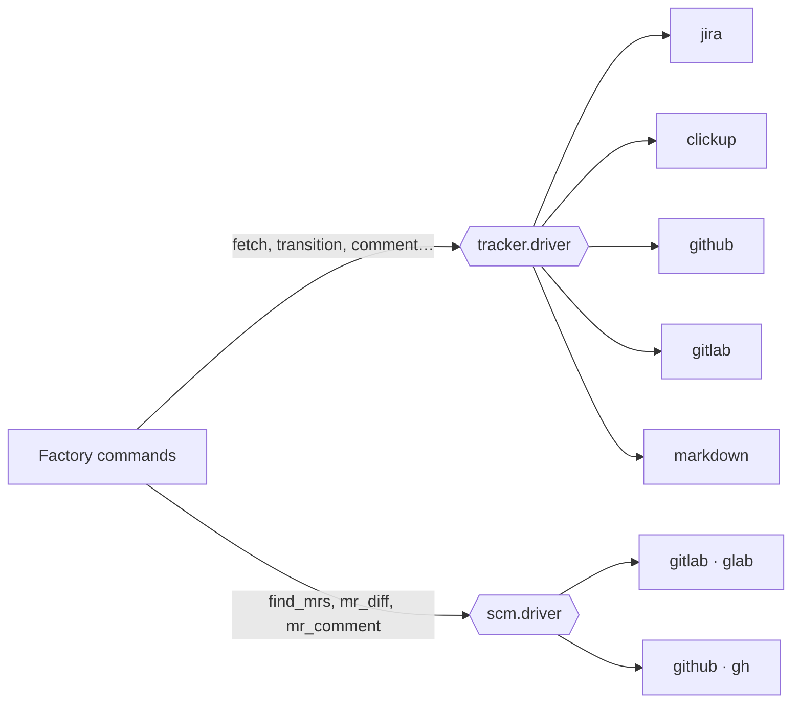

# Concepts

The factory is small on purpose: five commands, a few agents and a contract. What makes it serve
different projects are four ideas.

## 1. One config per project

All project-specific knowledge lives in **`docs/factory.config.md`**, in the repository itself:
which tracker, which statuses, where the backend and frontend are, what the stack is, how to build, how to run the tests,
which branch to start from, how to commit.

The commands never have hardcoded values. They read `{config.git.base_branch}`, `{config.stack.backend.build}` and
so on. This has two consequences:

- **Every command starts with STEP 0:** it loads the config and validates the keys that factory needs. If
  one is missing, or if one is set to `TBD`, it **stops** and tells you which key to fill in, instead of
  improvising.
- **Switching projects does not change the factory.** Switching tracker, base branch or stack means editing the config.

See every key in the [Configuration reference](reference/config.md).

## 2. The contract and the drivers

The commands don't know whether the task is in Jira, ClickUp, GitLab, GitHub or a Markdown file. They talk
to the tracker only through **abstract operations** defined in `CONTRACT.md`:

| Operation | What it does |
|---|---|
| `fetch(id)` | reads the task: title, type, status, parent, branch, description |
| `transition(id, status)` | moves the task to a logical status |
| `comment(id, text)` | comments on the task |
| `create_child_bug(task, title, body)` | opens a bug linked to the task |
| `label(id, label)` | applies a logical label |
| `create_epic` · `create_story` · `link_dependency` · `update_epic` | authoring, used by the PO factory |

What translates each operation into the real call is the **driver** chosen in `tracker.driver`. There are two axes
of drivers, because the task and the code don't always live in the same system (task in ClickUp, MR in GitLab, for
example):



**Golden rule:** if you need to edit a command to support a new tracker, something is wrong.
A new tracker is a new file in `drivers/trackers/`, and nothing else. See [Drivers](reference/drivers.md).

## 3. Logical statuses and labels

Each tracker names its states its own way. The factory uses **logical names**, and the config translates them to what
your tracker understands:

| Logical | Meaning | Used by |
|---|---|---|
| `backlog` | the story exists, nobody has started | PO creates here · DEV reads |
| `in_progress` | development in progress | DEV |
| `qa_gate` | ready for QA (DEV → QA handoff) | DEV moves · QA reads |
| `in_qa` | QA in progress | QA |
| `done` | approved in QA | QA |
| `review_gate` · `in_review` | ready for CR · CR in progress | CR |
| `review_approved` · `review_returned` | CR approved (moves forward) · CR rejected (goes back) | CR |

The value of each one depends on the driver: in Jira and ClickUp it is the status name (`"Em QA"`); in GitLab and GitHub it is
a state plus a label (`{state: opened, label: ready-for-qa}`); in Markdown it is a folder plus a label.

!!! warning "Gates must be distinguishable"
    `qa_gate` and `in_qa` can **never** resolve to the same value, nor can `review_gate` and `in_review`. This is how
    the factory knows a task is already being worked on and doesn't pick it up again.

## 4. Orchestrator, workers and gates

Each factory has an **orchestrator** (the command) and several **workers** (the roles). The orchestrator is the only one
that talks to you and to the tracker. The workers:

- each run in their **own context**, without inheriting the conversation;
- receive only a **briefing** (task, paths, scope) and return an artifact in `docs/initiatives/<name>/`;
- in the DEV factory they are *agents* with tools restricted by construction: the tech lead has neither `Edit` nor
  `Bash` (it cannot write code) and the code reviewer has no `Edit` (it doesn't fix what it reviews).

After each step there is a **gate**: the orchestrator checks that the expected artifact exists and has what it
needs. A failed gate stops the factory and reports; nothing is skipped or made up.

In the DEV factory the agents return a standardized `STATUS:`:

| STATUS | The orchestrator |
|---|---|
| `OK` · `PASSED` · `APPROVED` | continues |
| `APPROVED_WITH_NOTES` | continues and carries the caveats into the report |
| `REJECTED` · `FAILED` | goes back to the developer with the report, spending one attempt |
| `BLOCKED` | **stops and asks you** |
| `UPSTREAM_BUG` | escalates to you, without spending an attempt |

## 5. Artifacts: everything stays in the repository

Each initiative gets a `docs/initiatives/<name>/` folder with everything the factories produced:

```text
docs/initiatives/login-with-google/
├── research.md              # PO: market research
├── codemap.md               # PO: what already exists in the code
├── blueprint.md             # PO: machine-ready specification
├── tasks-report.md          # PO: Epic and Stories created
├── tech-lead-APP-012.md     # DEV: technical plan
├── code-review-APP-012-1.md # DEV: review of attempt 1
├── self-test-APP-012.md     # DEV: build and manual checklist
├── doc-sync-report-APP-012.md
├── qa-plan-APP-012.md       # QA: test plan
├── qa-report-APP-012.md     # QA: result
└── evidencias/              # QA: videos, screenshots, logs
```

This gives traceability: you can find out why a decision was made by reading the blueprint and the technical plan,
months later.
