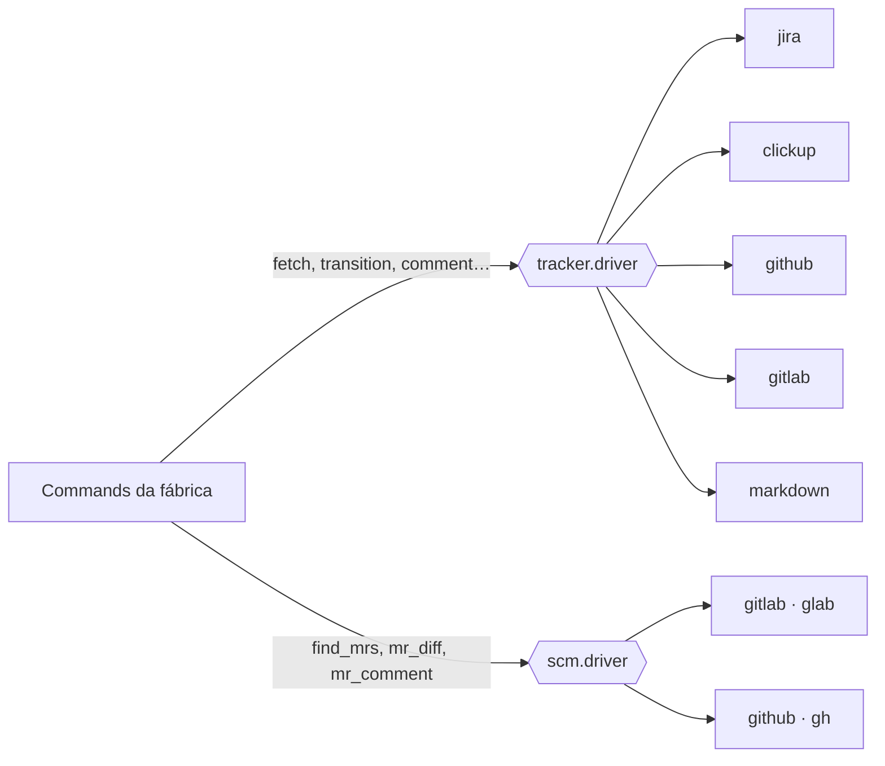

# Conceitos

A fábrica é pequena de propósito: cinco commands, alguns agents e um contrato. O que faz ela servir
projetos diferentes são quatro ideias.

## 1. Um config por projeto

Todo o conhecimento específico do projeto vive em **`docs/factory.config.md`**, no próprio repositório:
qual tracker, quais status, onde ficam backend e frontend, qual a stack, como buildar, como rodar os testes,
de qual branch sair, como commitar.

Os commands nunca têm valor fixo. Eles leem `{config.git.base_branch}`, `{config.stack.backend.build}` e
assim por diante. Isso tem duas consequências:

- **Todo command começa pela ETAPA 0:** carrega o config e valida as chaves que aquela fábrica precisa. Se
  faltar alguma, ou se alguma estiver como `TBD`, ele **para** e diz qual chave preencher, em vez de
  improvisar.
- **Mudar de projeto não muda a fábrica.** Mudar de tracker, de branch base ou de stack é editar o config.

Veja todas as chaves em [Referência de configuração](reference/config.md).

## 2. O contrato e os drivers

Os commands não sabem se a task está no Jira, no ClickUp, no GitLab, no GitHub ou num arquivo Markdown. Eles falam
com o tracker só por **operações abstratas** definidas no `CONTRACT.md`:

| Operação | O que faz |
|---|---|
| `fetch(id)` | lê a task: título, tipo, status, pai, branch, descrição |
| `transition(id, status)` | move a task para um status lógico |
| `comment(id, texto)` | comenta na task |
| `create_child_bug(task, título, corpo)` | abre um bug ligado à task |
| `label(id, label)` | aplica uma label lógica |
| `create_epic` · `create_story` · `link_dependency` · `update_epic` | autoria, usadas pela fábrica PO |

Quem traduz cada operação para a chamada real é o **driver** escolhido em `tracker.driver`. Há dois eixos
de drivers, porque a task e o código nem sempre moram no mesmo sistema (task no ClickUp, MR no GitLab, por
exemplo):



**Regra de ouro:** se para suportar um tracker novo você precisa editar um command, algo está errado.
Tracker novo é um arquivo novo em `drivers/trackers/`, e mais nada. Veja [Drivers](reference/drivers.md).

## 3. Status e labels lógicos

Cada tracker nomeia os estados do seu jeito. A fábrica usa **nomes lógicos**, e o config traduz para o que
o seu tracker entende:

| Lógico | Significado | Usado por |
|---|---|---|
| `backlog` | a story existe, ninguém começou | PO cria aqui · DEV lê |
| `in_progress` | desenvolvimento em andamento | DEV |
| `qa_gate` | pronto para QA (handoff DEV → QA) | DEV move · QA lê |
| `in_qa` | QA em andamento | QA |
| `done` | aprovado no QA | QA |
| `review_gate` · `in_review` | pronto para CR · CR em andamento | CR |
| `review_approved` · `review_returned` | CR aprovou (avança) · CR reprovou (volta) | CR |

O valor de cada um depende do driver: no Jira e no ClickUp é o nome do status (`"Em QA"`); no GitLab e no GitHub é
um estado mais uma label (`{state: opened, label: ready-for-qa}`); no Markdown é uma pasta mais uma label.

!!! warning "Portões precisam ser distinguíveis"
    `qa_gate` e `in_qa` **nunca** podem resolver para o mesmo valor, nem `review_gate` e `in_review`. É assim
    que a fábrica sabe que uma task já está sendo trabalhada e não a pega de novo.

## 4. Orquestrador, workers e gates

Cada fábrica tem um **orquestrador** (o command) e vários **workers** (os papéis). O orquestrador é o único
que fala com você e com o tracker. Os workers:

- rodam cada um no **próprio contexto**, sem herdar a conversa;
- recebem só um **briefing** (task, caminhos, escopo) e devolvem um artefato em `docs/initiatives/<nome>/`;
- na fábrica DEV são *agents* com ferramentas restritas por construção: o tech lead não tem `Edit` nem
  `Bash` (não consegue escrever código) e o code reviewer não tem `Edit` (não conserta o que revisa).

Depois de cada etapa há um **gate**: o orquestrador confere se o artefato esperado existe e tem o que
precisa. Gate reprovado para a fábrica e reporta; nada é pulado nem inventado.

Na fábrica DEV os agents devolvem um `STATUS:` padronizado:

| STATUS | O orquestrador |
|---|---|
| `OK` · `PASSED` · `APPROVED` | segue |
| `APPROVED_WITH_NOTES` | segue e leva as ressalvas para o relatório |
| `REJECTED` · `FAILED` | volta ao developer com o relatório, gastando uma tentativa |
| `BLOCKED` | **para e pergunta a você** |
| `UPSTREAM_BUG` | escala para você, sem gastar tentativa |

## 5. Artefatos: tudo fica no repositório

Cada iniciativa ganha uma pasta `docs/initiatives/<nome>/` com tudo o que as fábricas produziram:

```text
docs/initiatives/login-com-google/
├── research.md              # PO — pesquisa de mercado
├── codemap.md               # PO — o que já existe no código
├── blueprint.md             # PO — especificação machine-ready
├── tasks-report.md          # PO — Epic e Stories criadas
├── tech-lead-APP-012.md     # DEV — plano técnico
├── code-review-APP-012-1.md # DEV — review da tentativa 1
├── self-test-APP-012.md     # DEV — build e checklist manual
├── doc-sync-report-APP-012.md
├── qa-plan-APP-012.md       # QA — plano de testes
├── qa-report-APP-012.md     # QA — resultado
└── evidencias/              # QA — vídeos, screenshots, logs
```

Isso dá rastreabilidade: dá para saber por que uma decisão foi tomada lendo o blueprint e o plano técnico,
meses depois.
