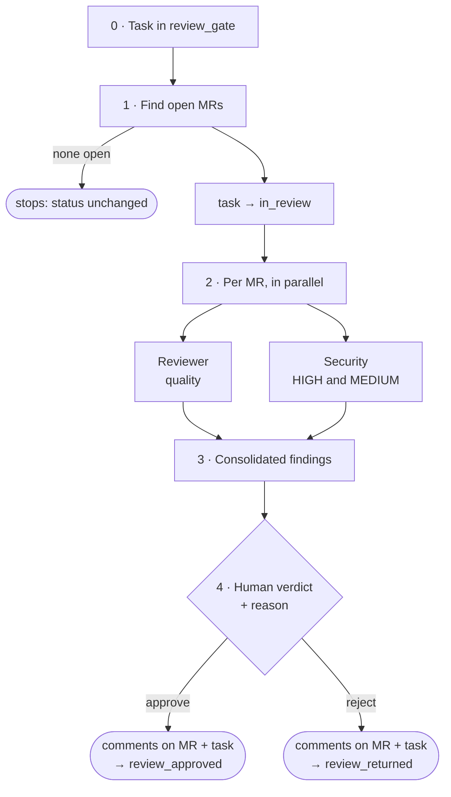

# /factory:cr

Does the **code review of a task's Merge Requests / Pull Requests**: finds the MRs, reviews each one with
two agents in parallel (quality and security), shows the findings, **waits for your verdict**, comments on the
MR and on the task and moves the status.

```text
/factory:cr <task-id> [--model role=value]
```

!!! info "Read-only on git"
    The CR factory never checks out, never switches branches and never commits. The diff comes from `glab mr diff`,
    `gh pr diff` or `git diff` against the remote reference. You can run it in the middle of your work without touching
    your branch.

## Pipeline



### 1. Find the MRs

The SCM driver looks for the MRs linked to the task:

1. links in the task's body and comments;
2. if there are none, by the branch convention (`scm.branch_convention`) across all repositories in
   `scm.repos`, warning that they were found this way.

It keeps only the MRs targeting `scm.mr_target` and discards the twin branch (`scm.exclude_branch_suffix`, useful
when the team keeps a copy of the branch for another environment). MRs already merged or closed are skipped.
**With no open MR, the factory doesn't touch the status** and asks whether you want to provide the MRs by hand.

### 2. Review: two agents per MR

=== "Reviewer"
    Builds a checklist from the project's stack and the CodeBase conventions and returns findings by
    `file:line`:

    - 🔴 **critical**: bug, contract break, missing authorization, data loss;
    - 🟡 **important**: duplication, deviation from the pattern, missing test;
    - 🟢 **suggestion** and 📄 **documentation**.

    Security shows up here only when it is glaring; the dedicated pass belongs to the other agent.

=== "Security"
    A **security-only** pass over the same diff:

    - injection (SQL, command, template), *path traversal*, XXE;
    - authentication and **authorization**, including IDOR and missing *scoping* by owner or tenant;
    - crypto, secrets in the code, weak randomness;
    - deserialization and dynamic execution with user data, XSS;
    - data exposure in logs, API responses or errors.

    Reports **only HIGH and MEDIUM with confidence of 0.7 or higher**, each with its exploitation scenario. HIGH
    becomes 🔴 and MEDIUM becomes 🟡. "0 HIGH · 0 MEDIUM" is a valid result and shows up in the report.

When both point to the same `file:line`, the higher severity and the security description are kept.

### 3 and 4. Findings and human verdict

The factory shows the table of findings per MR and **recommends**: reject if there is any 🔴 (every security HIGH
is 🔴), approve if there isn't. **You are the one who decides**, choosing to approve or reject and
writing the reason. Without an explicit answer, nothing happens.

### 5. Comment and move

1. **On each MR:** the full review, with the verdict and your reason.
2. **On the task:** the summary (MRs reviewed and skipped, verdict, reason, next actions).
3. **Status:**
    - approved → `review_approved` (and the `approved` label, if configured): **moves forward**;
    - rejected → `review_returned`: **goes back** to development.

## Config it requires

`tracker.status.review_gate`, `in_review`, `review_approved`, `review_returned`, `scm.driver`, `scm.repos`,
`scm.mr_target`, `scm.branch_convention`, `workspace.root`, `stack` and `docs_map.codebase`.

## Default models

| Role | Model |
|---|---|
| `cr.security` | `fable` |
| `cr.reviewer` | `opus` |
