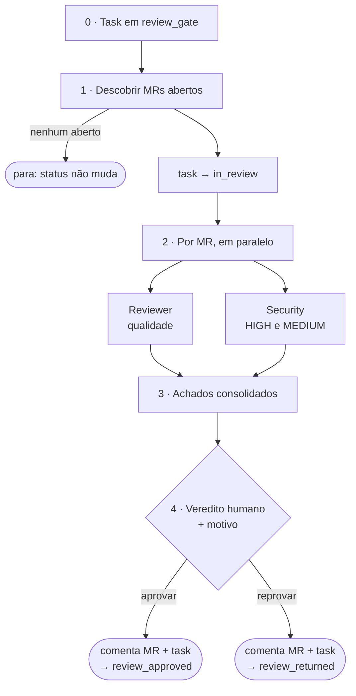

# /factory:cr

Faz o **code review dos Merge Requests / Pull Requests de uma task**: descobre os MRs, revisa cada um com
dois agentes em paralelo (qualidade e segurança), mostra os achados, **espera o seu veredito**, comenta no
MR e na task e move o status.

```text
/factory:cr <task-id> [--model papel=valor]
```

!!! info "Somente leitura no git"
    A fábrica CR nunca faz checkout, nunca troca de branch e nunca commita. O diff vem de `glab mr diff`,
    `gh pr diff` ou `git diff` contra a referência remota. Dá para rodar no meio do seu trabalho sem mexer na
    sua branch.

## Pipeline



### 1. Descobrir os MRs

O driver de SCM procura os MRs ligados à task:

1. links no corpo e nos comentários da task;
2. se não houver, pela convenção de branch (`scm.branch_convention`) em todos os repositórios de
   `scm.repos`, avisando que veio por essa via.

Mantém só os MRs com destino `scm.mr_target` e descarta a branch gêmea (`scm.exclude_branch_suffix`, útil
quando o time mantém uma cópia da branch para outro ambiente). MRs já mergeados ou fechados são pulados.
**Sem nenhum MR aberto, a fábrica não mexe no status** e pergunta se você quer informar os MRs à mão.

### 2. Revisar: dois agentes por MR

=== "Reviewer"
    Projeta um checklist a partir da stack do projeto e das convenções do CodeBase e devolve achados por
    `arquivo:linha`:

    - 🔴 **crítico**: bug, quebra de contrato, falta de autorização, perda de dado;
    - 🟡 **importante**: duplicação, desvio do padrão, falta de teste;
    - 🟢 **sugestão** e 📄 **documentação**.

    Segurança aparece aqui só quando salta aos olhos; a passada dedicada é do outro agente.

=== "Security"
    Passada **só de segurança** sobre o mesmo diff:

    - injeção (SQL, comando, template), *path traversal*, XXE;
    - autenticação e **autorização**, incluindo IDOR e falta de *scoping* por dono ou tenant;
    - cripto, segredos no código, aleatoriedade fraca;
    - desserialização e execução dinâmica com dado do usuário, XSS;
    - exposição de dados em log, resposta de API ou erro.

    Reporta **só HIGH e MEDIUM com confiança de 0,7 ou mais**, cada um com o cenário de exploração. HIGH
    vira 🔴 e MEDIUM vira 🟡. "0 HIGH · 0 MEDIUM" é um resultado válido e aparece no relatório.

Quando os dois apontam o mesmo `arquivo:linha`, fica a severidade maior e a descrição da segurança.

### 3 e 4. Achados e veredito humano

A fábrica mostra a tabela de achados por MR e **recomenda**: reprovar se houver algum 🔴 (todo HIGH de
segurança é 🔴), aprovar se não houver. **Quem decide é você**, escolhendo aprovar ou reprovar e
escrevendo o motivo. Sem resposta explícita, nada acontece.

### 5. Comentar e mover

1. **Em cada MR:** o review completo, com o veredito e o seu motivo.
2. **Na task:** o resumo (MRs revisados e pulados, veredito, motivo, próximas ações).
3. **Status:**
    - aprovado → `review_approved` (e a label `approved`, se configurada): **avança**;
    - reprovado → `review_returned`: **volta** para o desenvolvimento.

## Config que ela exige

`tracker.status.review_gate`, `in_review`, `review_approved`, `review_returned`, `scm.driver`, `scm.repos`,
`scm.mr_target`, `scm.branch_convention`, `workspace.root`, `stack` e `docs_map.codebase`.

## Modelos padrão

| Papel | Modelo |
|---|---|
| `cr.security` | `fable` |
| `cr.reviewer` | `opus` |
