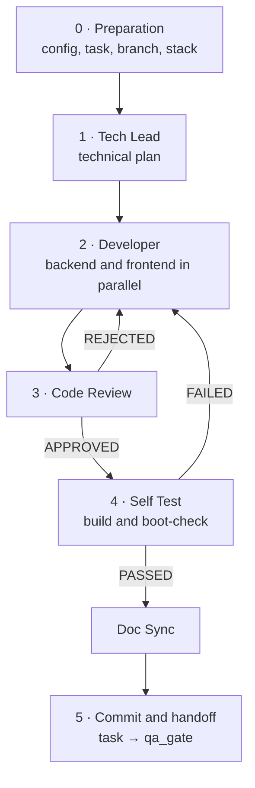

# /factory:dev

Takes **a task from the backlog to the QA handoff**: plans, implements, reviews, validates the build, syncs the
code documentation and moves the task to `qa_gate`.

```text
/factory:dev <task-id> [--model role=value]
```

The orchestrator is the only one that talks to you and to the tracker. The workers are plugin **agents**
(`factory:dev-*`), each with the tools of its role and nothing beyond that.

## Pipeline



The doc sync can run **before the review** or **after the self test**, according to `dev.doc_sync_order`.

### 0. Preparation

1. Validates the config and loads the tracker driver.
2. Reads the task. It must be in `backlog` or `in_progress`; in any other status, the factory stops and warns you
   (it may be rework or a return from QA).
3. Discovers the **branch** through the driver: in some trackers it comes from a convention, in others from a field
   of the task. The factory never assumes the format.
4. Discovers which repositories the task touches (backend, frontend or both). If it can't tell, it asks.
5. Brings up the stack, if `docker.ensure_up` is on.
6. Saves the work in progress of each repository in a named **stash** (preserves it, doesn't discard it).
7. Moves the task to `in_progress`.
8. Checks out the branch, or creates it from `git.dev_base`.

### 1. Tech Lead: the plan

Agent **without `Edit` and without `Bash`**: by construction it doesn't write code or run commands; it only reads and writes the
plan. It reads the CodeBase before opening code and, if the task belongs to an epic, also reads research, codemap and
blueprint.

=== "Story"
    - summary of what the PO asked for and of the acceptance criteria;
    - **impact map** with the real names from the code: entities, services, jobs, endpoints, migrations,
      pages, components to reuse;
    - technical approach and risks (cache, performance, data boundaries, security);
    - subtask plan, **marking what is backend and what is frontend**;
    - validation checklist.

=== "Bug"
    - diagnosis: symptom, expected behavior, reproduction steps;
    - **root cause with `file:line`**, tracing the flow from the request down to the database;
    - **surgical fix** plan and the side effects to watch for;
    - acceptance criteria and checklist.

### 2. Developer: the code

Implements **only its own scope** (`backend`, `frontend` or `ambos`), following the stack's patterns and reusing what
already exists. With `dev.developer_split: true` and a task that touches both sides, the orchestrator spins up
**two instances in parallel**, one per repository. The frontend implements against the contract the tech
lead defined, without waiting for the backend.

The developer **doesn't edit `docs/`** and **doesn't commit**. If the current branch is not the expected one or is protected, it
returns `BLOCKED` instead of creating a branch on its own.

### 3. Code Review

Agent **without `Edit`**: it points out, it doesn't fix. It reviews the diff against the plan and the project's patterns:

- 🔴 **critical**, blocks: stack architecture, validation, **authorization** on the endpoint, *scoping* by
  owner or tenant, persistence, error handling, secret in the code, improper commit;
- 🟡 **important**: duplication of what already exists, the area's pattern, reuse of helpers;
- 🟢 suggestion and 📄 documentation.

`REJECTED` goes back to the developer with the list of `file:line` and **only the scope that needs fixing**. Each
round trip spends one of the `dev.retries` attempts; once they run out, the factory stops and calls you.

### 4. Self Test

Validates that the implementation **compiles and boots**: runs `stack.backend.build` (migrate, cache, routes…) and
`stack.frontend.build`, plus the lint if configured. Checks that the new artifacts show up, such as a new route
in the listing.

Builds a **"Self-test result"** section with the build result and a **manual validation checklist**
derived from the acceptance criteria. The orchestrator posts that section on the task.

The formal test suite is informational here; the one that really runs it is the QA factory.

### Doc Sync

Keeps the **CodeBase maps** aligned with the code: for each changed file, it updates the
corresponding map (entities, services, routes, components) with a surgical edit, without rewriting the document.
According to `dev.commit.by`, it either commits code and docs itself, or just leaves the edits on disk.

### 5. Commit and handoff

- **`dev.commit.by: pipeline`**: the orchestrator makes the selective commit with `git.commit_format`.
- **`dev.commit.by: doc_sync`**: the doc sync has already committed (including the submodule pointer, if any).
- **Push** according to `dev.commit.push`: `manual` doesn't push; `mr` opens the Merge Request.
- Moves the task to **`qa_gate`**.

## Guarantees

- Never commits to or creates branches in `git.protected`; never `push --force`.
- Any `BLOCKED` from an agent becomes **a question for you**; nobody makes up an answer.
- The developer never touches `docs/`; only the doc sync writes to the maps.

## Default models

| Role | Model |
|---|---|
| `dev.tech_lead` · `dev.code_reviewer` | `fable` |
| `dev.developer` | `opus` |
| `dev.self_test` · `dev.doc_sync` | `sonnet` |
