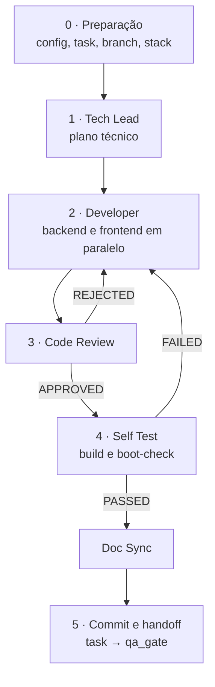

# /factory:dev

Leva **uma task do backlog até o handoff de QA**: planeja, implementa, revisa, valida o build, sincroniza a
documentação do código e move a task para `qa_gate`.

```text
/factory:dev <task-id> [--model papel=valor]
```

O orquestrador é o único que fala com você e com o tracker. Os workers são **agents** do plugin
(`factory:dev-*`), cada um com as ferramentas do seu papel e nada além.

## Pipeline



O doc sync pode rodar **antes do review** ou **depois do self test**, conforme `dev.doc_sync_order`.

### 0. Preparação

1. Valida o config e carrega o driver do tracker.
2. Lê a task. Ela precisa estar em `backlog` ou `in_progress`; em outro status, a fábrica para e avisa
   (pode ser retrabalho ou um retorno do QA).
3. Descobre a **branch** pelo driver: em alguns trackers ela vem de uma convenção, em outros de um campo
   da task. A fábrica nunca assume o formato.
4. Descobre quais repositórios a task toca (backend, frontend ou os dois). Se não der para saber, pergunta.
5. Sobe a stack, se `docker.ensure_up` estiver ligado.
6. Guarda o trabalho em andamento de cada repositório num **stash** nomeado (preserva, não descarta).
7. Move a task para `in_progress`.
8. Faz checkout da branch, ou cria a partir de `git.dev_base`.

### 1. Tech Lead: o plano

Agent **sem `Edit` e sem `Bash`**: por construção não escreve código nem roda comando; só lê e escreve o
plano. Lê o CodeBase antes de abrir código e, se a task é de um épico, lê também research, codemap e
blueprint.

=== "Story"
    - resumo do que o PO pediu e dos critérios de aceite;
    - **mapa de impacto** com os nomes reais do código: entidades, services, jobs, endpoints, migrations,
      páginas, componentes a reusar;
    - abordagem técnica e riscos (cache, performance, fronteiras de dados, segurança);
    - plano de subtasks, **marcando o que é backend e o que é frontend**;
    - checklist de validação.

=== "Bug"
    - diagnóstico: sintoma, esperado, passos de reprodução;
    - **causa raiz com `arquivo:linha`**, rastreando o fluxo da request até o banco;
    - plano de **correção cirúrgica** e os efeitos colaterais a vigiar;
    - critérios de aceite e checklist.

### 2. Developer: o código

Implementa **só o seu escopo** (`backend`, `frontend` ou `ambos`), seguindo os padrões da stack e reusando o
que já existe. Com `dev.developer_split: true` e uma task que toca os dois lados, o orquestrador sobe
**duas instâncias em paralelo**, uma por repositório. O frontend implementa contra o contrato que o tech
lead definiu, sem esperar o backend.

O developer **não edita `docs/`** e **não commita**. Se a branch atual não é a esperada ou é protegida, ele
devolve `BLOCKED` em vez de criar branch por conta própria.

### 3. Code Review

Agent **sem `Edit`**: aponta, não conserta. Revisa o diff contra o plano e os padrões do projeto:

- 🔴 **crítico**, bloqueia: arquitetura da stack, validação, **autorização** no endpoint, *scoping* por
  dono ou tenant, persistência, tratamento de erro, segredo no código, commit indevido;
- 🟡 **importante**: duplicação do que já existe, padrão da área, reuso de helpers;
- 🟢 sugestão e 📄 documentação.

`REJECTED` volta ao developer com a lista de `arquivo:linha` e **só o escopo que precisa de correção**. Cada
volta gasta uma das `dev.retries` tentativas; esgotou, a fábrica para e chama você.

### 4. Self Test

Valida que a implementação **compila e sobe**: roda `stack.backend.build` (migrate, cache, rotas…) e
`stack.frontend.build`, mais o lint se configurado. Confere que os artefatos novos aparecem, como uma rota
nova na listagem.

Monta uma seção **"Self-test result"** com o resultado do build e um **checklist de validação manual**
derivado dos critérios de aceite. O orquestrador publica essa seção na task.

A suíte de testes formal é informativa aqui; quem roda de verdade é a fábrica QA.

### Doc Sync

Mantém os **mapas do CodeBase** alinhados com o código: para cada arquivo alterado, atualiza o mapa
correspondente (entidades, services, rotas, componentes) com edição cirúrgica, sem reescrever o documento.
Conforme `dev.commit.by`, ele mesmo commita código e docs, ou só deixa as edições no disco.

### 5. Commit e handoff

- **`dev.commit.by: pipeline`**: o orquestrador faz o commit seletivo com `git.commit_format`.
- **`dev.commit.by: doc_sync`**: o doc sync já commitou (inclusive o ponteiro de submódulo, se houver).
- **Push** conforme `dev.commit.push`: `manual` não faz push; `mr` abre o Merge Request.
- Move a task para **`qa_gate`**.

## Garantias

- Nunca commita nem cria branch em `git.protected`; nunca `push --force`.
- Qualquer `BLOCKED` de agent vira **pergunta para você**; ninguém inventa resposta.
- O developer nunca toca `docs/`; só o doc sync escreve nos mapas.

## Modelos padrão

| Papel | Modelo |
|---|---|
| `dev.tech_lead` · `dev.code_reviewer` | `fable` |
| `dev.developer` | `opus` |
| `dev.self_test` · `dev.doc_sync` | `sonnet` |
