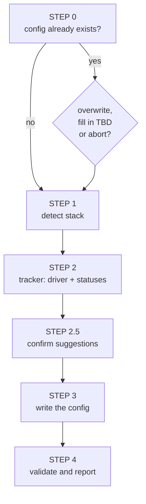

# /factory:init

Generates the project's **`docs/factory.config.md`**. It is the first command to run in a new repository: all
the other factories stop at STEP 0 if the config doesn't exist.

```text
/factory:init [project-path]
```

Without an argument, it uses the current directory.

## What it does



1. **Pre-check.** Confirms it is a repository. If the config already exists, shows its beginning and asks whether to
   overwrite, fill in only the `TBD`s or abort.
2. **Stack, read-only.** Detects language, framework, ORM, tests, E2E and build from evidence:
    - `composer.json` + `artisan` → Laravel;
    - `package.json` with `@nestjs/*`, `next` or `@angular/core` → NestJS, Next.js or Angular;
    - lockfile → package manager (`pnpm`, `yarn`, `npm`, `composer`);
    - `.gitmodules` and project folders → layout (`single`, `multi-repo`, `monorepo-submodule`);
    - `docker-compose` → containers, ports, `env.app_url` and `env.api_url`;
    - git remote and branches → `git.base_branch`, `git.dev_base`, protected branches;
    - `docs/` → where the CodeBase and the conventions are.
3. **Tracker.** Proposes the driver based on the remote and the repository structure and **confirms it with you**, because
   it is the highest-impact choice. Then it fills in the logical status map.
4. **Suggestions.** A framework outside the known list is not left blank: the command gathers evidence
   (runtime dependencies, `start` script, characteristic config files, manifests from other
   languages) and asks. With two or more pieces of evidence it becomes a suggestion; with one, a weak candidate.
5. **Writes** the config in the contract format.
6. **Validates** the required keys and says, per factory, what is missing for it to run.

## How it handles what it doesn't know

`/factory:init` **doesn't make up values**. Four possible outcomes for each key:

| Situation | What goes into the config |
|---|---|
| inferred safely | the concrete value |
| guess you confirmed | the concrete value |
| unconfirmed guess | `TBD   # sugestão: "X" — evidência: package.json:dependencies.x, …` |
| no evidence | `TBD   # sem evidência` |

When a factory finds a `TBD` with a suggestion, it stops and **shows the suggestion**, so you only need to confirm it.

## Report

At the end, a table with the detected stack, the chosen driver, the list of pending `TBD`s and whether each factory
can already run (for example: "QA: postponed, missing `tests.layout.frontend`").
