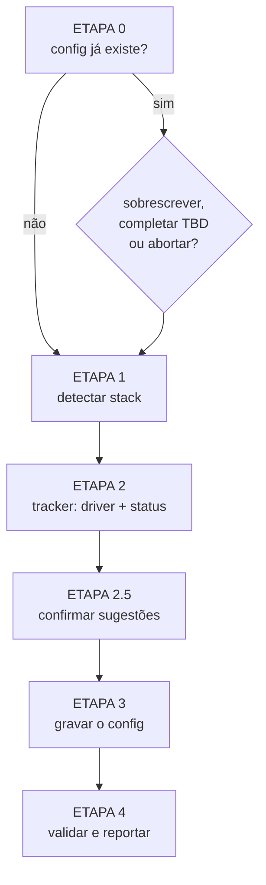

# /factory:init

Gera o **`docs/factory.config.md`** do projeto. É o primeiro command a rodar num repositório novo: todas as
outras fábricas param na ETAPA 0 se o config não existir.

```text
/factory:init [caminho-do-projeto]
```

Sem argumento, usa o diretório atual.

## O que ele faz



1. **Pré-checagem.** Confirma que é um repositório. Se o config já existe, mostra o começo e pergunta se
   sobrescreve, completa só os `TBD` ou aborta.
2. **Stack, só leitura.** Detecta linguagem, framework, ORM, testes, E2E e build por evidência:
    - `composer.json` + `artisan` → Laravel;
    - `package.json` com `@nestjs/*`, `next` ou `@angular/core` → NestJS, Next.js ou Angular;
    - lockfile → gerenciador de pacotes (`pnpm`, `yarn`, `npm`, `composer`);
    - `.gitmodules` e pastas de projeto → layout (`single`, `multi-repo`, `monorepo-submodule`);
    - `docker-compose` → containers, portas, `env.app_url` e `env.api_url`;
    - remote e branches do git → `git.base_branch`, `git.dev_base`, branches protegidas;
    - `docs/` → onde está o CodeBase e as convenções.
3. **Tracker.** Propõe o driver pelo remote e pela estrutura do repositório e **confirma com você**, porque
   é a escolha de maior impacto. Depois preenche o mapa de status lógicos.
4. **Sugestões.** Framework fora da lista conhecida não fica em branco: o command coleta evidências
   (dependências de runtime, script de `start`, arquivos de config característicos, manifestos de outras
   linguagens) e pergunta. Com duas evidências ou mais vira sugestão; com uma, candidato fraco.
5. **Grava** o config no formato do contrato.
6. **Valida** as chaves obrigatórias e diz, por fábrica, o que falta para ela rodar.

## Como ele trata o que não sabe

O `/factory:init` **não inventa valor**. Quatro saídas possíveis para cada chave:

| Situação | O que vai para o config |
|---|---|
| inferido com segurança | o valor concreto |
| palpite que você confirmou | o valor concreto |
| palpite não confirmado | `TBD   # sugestão: "X" — evidência: package.json:dependencies.x, …` |
| nenhuma evidência | `TBD   # sem evidência` |

Quando uma fábrica encontra um `TBD` com sugestão, ela para e **mostra a sugestão**, para você só confirmar.

## Relatório

No fim, uma tabela com a stack detectada, o driver escolhido, a lista de `TBD` pendentes e se cada fábrica
já consegue rodar (por exemplo: "QA: adiada, falta `tests.layout.frontend`").
