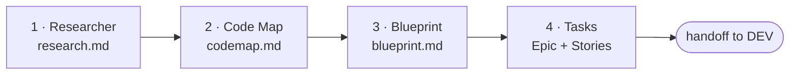

# /factory:po

Turns a **roadmap initiative** into **Epic + Stories ready in the tracker**, with a specification
detailed enough for the DEV factory to implement without researching again.

```text
/factory:po <initiative> [--model role=value]
```

Example: `/factory:po Payment gateway integration`. Without an argument, the factory asks which
initiative to process. Everything it produces goes into `docs/initiatives/<initiative-in-kebab-case>/`.

## Pipeline

The four steps run **in sequence**, each in an isolated agent, with a gate at the end:



Research and mapping could run in parallel, but the sequence is intentional: the code map is better
when it already knows what the market does.

### 1. Researcher: what the market does

Investigates how other products solve the problem. **Focus on product, never on architecture**.

- Reads the product context from the config: `product.domain`, `product.personas`, `product.competitors` and
  `product.compliance`.
- Searches the web for at least **three competitors**: the listed ones, or ones discovered from the domain.
- Gathers good practices, anti-patterns, benchmarks with real numbers and the concerns of each compliance
  regime (LGPD, for example).
- Separates **MVP (80/20)** from **full scope**.

**Gate:** `research.md` with a comparison table, an MVP recommendation and, if there is compliance, the check.
Couldn't find a benchmark? The report says it couldn't find one; the rule is not to make up data.

### 2. Code Map: what already exists

Cross-references the initiative with the project's **CodeBase** (`docs_map.codebase`), reading the **maps and the documentation
before opening source code**. If it needs to open a file, it records which one and why.

Delivers:

- what related things already exist (entities, services, jobs, pages, routes, with paths);
- **gap analysis** per feature: ✅ already exists · 🟡 partial · ❌ build from scratch · ⚠️ conflicts;
- dependencies, required migrations, affected areas, technical risks and suggested order.

**Gate:** mapped the existing code, the gaps, the dependencies and the risks.

### 3. Blueprint: the machine-ready specification

The blueprint **is not for a human to interpret**: it is for the tech lead to consume without ambiguity. For each
MVP feature:

| Section | Content |
|---|---|
| Current context | what exists in the code, with the real names from the code map |
| Backend | persistence (fields, types, indexes), services with signature and types, endpoints with route, validation and **authorization** |
| Frontend | route and guard, components, data service, types, menu per role |
| Error handling | HTTP status and error codes in the project's format |
| Acceptance criteria | **testable** checkboxes: happy path, validations, permissions per persona, edge cases |
| Compliance and observability | consent, retention, auditing, when the domain calls for it |

The vocabulary (migration, controller, entity, use case…) comes from `config.stack`, so the blueprint of
a Laravel project and that of a NestJS one each speak their own language. Whatever is unclear becomes a **question**, not
an assumption.

**Gate:** each feature has backend, frontend, error handling, testable criteria and complexity
(P/M/G: small/medium/large).

### 4. Tasks: Epic and Stories in the tracker

Uses the contract's authoring operations, so it works the same in Jira, ClickUp, GitLab or Markdown:

1. creates the **Epic** with a summary, the MVP scope and pointers to the three artifacts;
2. creates **one Story per MVP feature**, with the **full blueprint block in the body** (without
   summarizing: this is what DEV will read);
3. links the dependencies **in both directions** and checks there are no cycles;
4. updates the Epic with the Stories table;
5. writes `tasks-report.md` with the created IDs.

**Gate:** Epic and Stories created, linked and listed in the report.

## What the PO factory doesn't do

- **It doesn't prioritize the sprint.** The stories are born in the backlog; order is the team's decision.
- **It doesn't create stories for Phase 2.** The full scope is described in the Epic, only as a reference.
- **It doesn't decide internal architecture.** Layers, patterns and code split belong to the tech lead, in DEV.

## Config it requires

`product.domain`, `product.personas`, `docs_map.codebase`, `stack.backend`, `stack.frontend` and the driver's
authoring keys (`tracker.project_path` in GitLab; `board_path`, `epic_folder`, `story_folder` and
`issue.id_format` in Markdown).

## Default models

| Role | Model |
|---|---|
| `po.researcher` · `po.codemap` | `opus` |
| `po.blueprint` | `fable` |
| `po.tasks` | `sonnet` |
