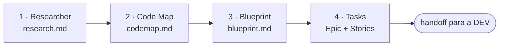

# /factory:po

Transforma uma **iniciativa do roadmap** em **Epic + Stories prontas no tracker**, com uma especificação
detalhada o bastante para a fábrica DEV implementar sem pesquisar de novo.

```text
/factory:po <iniciativa> [--model papel=valor]
```

Exemplo: `/factory:po Integração com gateway de pagamento`. Sem argumento, a fábrica pergunta qual
iniciativa processar. Tudo o que ela produz vai para `docs/initiatives/<iniciativa-em-kebab-case>/`.

## Pipeline

As quatro etapas rodam **em sequência**, cada uma num agente isolado, com um gate no fim:



Pesquisa e mapa poderiam rodar em paralelo, mas a sequência é proposital: o mapa do código fica melhor
quando já sabe o que o mercado faz.

### 1. Researcher: o que o mercado faz

Investiga como outros produtos resolvem o problema. **Foco em produto, nunca em arquitetura**.

- Lê o contexto de produto do config: `product.domain`, `product.personas`, `product.competitors` e
  `product.compliance`.
- Pesquisa na web pelo menos **três concorrentes**: os listados, ou descobertos a partir do domínio.
- Levanta boas práticas, anti-patterns, benchmarks com números reais e os cuidados de cada regime de
  compliance (LGPD, por exemplo).
- Separa **MVP (80/20)** de **escopo completo**.

**Gate:** `research.md` com tabela comparativa, recomendação de MVP e, se houver compliance, o check.
Não achou um benchmark? O relatório diz que não achou; a regra é não inventar dado.

### 2. Code Map: o que já existe

Cruza a iniciativa com o **CodeBase** do projeto (`docs_map.codebase`), lendo os **mapas e a documentação
antes de abrir código-fonte**. Se precisar abrir um arquivo, registra qual e por quê.

Entrega:

- o que já existe relacionado (entidades, services, jobs, páginas, rotas, com caminho);
- **gap analysis** por funcionalidade: ✅ já existe · 🟡 parcial · ❌ criar do zero · ⚠️ conflita;
- dependências, migrations necessárias, áreas afetadas, riscos técnicos e ordem sugerida.

**Gate:** mapeou o existente, os gaps, as dependências e os riscos.

### 3. Blueprint: a especificação machine-ready

O blueprint **não é para humano interpretar**: é para o tech lead consumir sem ambiguidade. Para cada
funcionalidade do MVP:

| Seção | Conteúdo |
|---|---|
| Contexto atual | o que existe no código, com os nomes reais do code map |
| Backend | persistência (campos, tipos, índices), services com assinatura e tipos, endpoints com rota, validação e **autorização** |
| Frontend | rota e guard, componentes, serviço de dados, tipos, menu por papel |
| Error handling | status HTTP e códigos de erro no formato do projeto |
| Critérios de aceite | checkboxes **testáveis**: caminho feliz, validações, permissões por persona, casos de borda |
| Compliance e observabilidade | consentimento, retenção, auditoria, quando o domínio pede |

O vocabulário (migration, controller, entidade, caso de uso…) vem de `config.stack`, então o blueprint de
um projeto Laravel e o de um NestJS falam a língua de cada um. O que não está claro vira **pergunta**, não
suposição.

**Gate:** cada funcionalidade tem backend, frontend, error handling, critérios testáveis e complexidade
(P/M/G).

### 4. Tasks: Epic e Stories no tracker

Usa as operações de autoria do contrato, então funciona igual em Jira, ClickUp, GitLab ou Markdown:

1. cria o **Epic** com resumo, escopo MVP e ponteiros para os três artefatos;
2. cria **uma Story por funcionalidade do MVP**, com o **bloco completo do blueprint no corpo** (sem
   resumir: é isso que a DEV vai ler);
3. liga as dependências **nos dois sentidos** e confere que não há ciclo;
4. atualiza o Epic com a tabela das Stories;
5. grava `tasks-report.md` com os IDs criados.

**Gate:** Epic e Stories criados, ligados e listados no relatório.

## O que a fábrica PO não faz

- **Não prioriza sprint.** As stories nascem no backlog; ordem é decisão do time.
- **Não cria story para a Fase 2.** O escopo completo fica descrito no Epic, só como referência.
- **Não decide arquitetura interna.** Camadas, padrões e divisão de código são do tech lead, na DEV.

## Config que ela exige

`product.domain`, `product.personas`, `docs_map.codebase`, `stack.backend`, `stack.frontend` e as chaves de
autoria do driver (`tracker.project_path` no GitLab; `board_path`, `epic_folder`, `story_folder` e
`issue.id_format` no Markdown).

## Modelos padrão

| Papel | Modelo |
|---|---|
| `po.researcher` · `po.codemap` | `opus` |
| `po.blueprint` | `fable` |
| `po.tasks` | `sonnet` |
