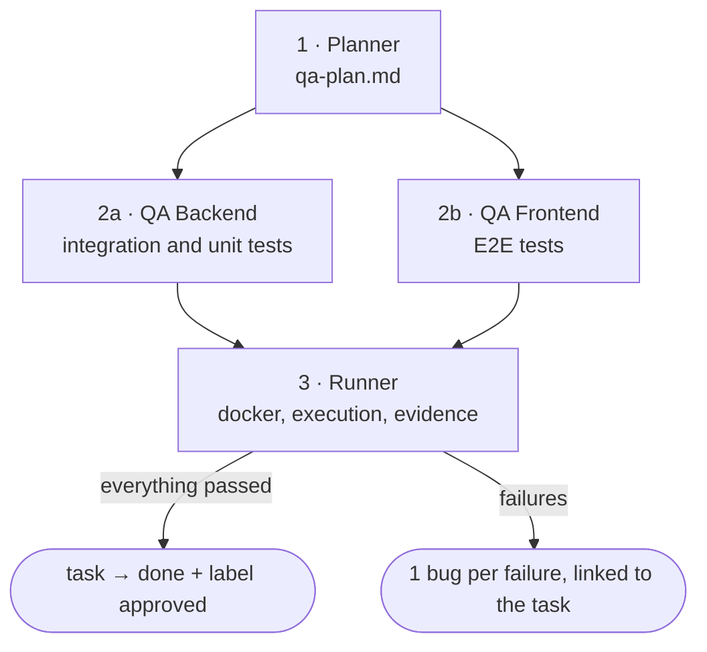

# /factory:qa

Tests **a task that is in `qa_gate`**: plans the scenarios from the blueprint, writes backend
and E2E tests by reading the real code, runs everything with video and evidence and closes the task, or opens bugs linked
to it.

```text
/factory:qa <task-id> [--model role=value]
```

## Pipeline



Backend and frontend run **in parallel**. STEP 0 is the same as in the other factories, with one extra lock: the
task **must** be in `qa_gate`, and `qa_gate` must be different from `in_qa`. That way a task already being
tested is never picked up again.

### 1. Planner: what to test

**It doesn't read source code.** It plans from the **expected behavior** (the task's blueprint) and from the list
of files changed on the branch, only classified by layer. When it starts, it moves the task to `in_qa` and
comments that QA has started.

The plan has scenarios with IDs, which later give the tests their names:

| Prefix | Type | Examples |
|---|---|---|
| `I-XX` | HTTP integration, per endpoint | happy path, required field, 404, unauthenticated (401), no permission (403), duplicate (409) |
| `U-XX` | unit | only for pure logic worth isolating from the database |
| `E-XX` | E2E, per screen | loads authenticated, redirects without login, create, form validation, edit, delete |
| `G-XX` | regression | neighboring areas the change may have affected |

If the project isolates data per user or tenant, the plan includes the "only sees their own" scenario. If the branch
is behind the base, the plan warns you to consider a rebase. The plan is saved and **posted on the task**.

### 2a. QA Backend: tests against the real code

**The implemented code is the source of truth.** Before writing, it opens controllers, validation, models,
services, routes and migrations to extract the **real** endpoint, parameters, statuses and error codes. If the
code diverges from the plan, it tests what was implemented and documents the divergence in the test itself.

- uses the project's framework (`stack.backend.test`) and the existing helpers (`tests.backend_helpers`);
- isolates each test with the stack's mechanism (transaction, ephemeral database or cleanup in the teardown);
- one scenario from the plan = one test, with the ID in the name (`I-01: …`);
- **never** mocks the ORM or guesses a field name; a dispatched job or event is tested with the stack's *fake*;
- found a bug while reading the code? It marks `// BUG POTENCIAL` and writes the test anyway.

### 2b. QA Frontend: E2E with real selectors

Works with **Cypress or Playwright**: `stack.frontend.e2e` picks the [E2E driver](../reference/drivers.md#e2e-drivers),
which defines the test syntax, login, waiting, selectors, evidence and result format.

Reads routes, guards, templates and components before writing and builds a **table of real selectors**
(form fields, buttons, `data-testid`, texts). An unstable selector gets a
`// TODO: data-testid` instead of a guess.

- **programmatic** login per role (`tests.frontend_cmds`, `tests.roles`), not through the form: a custom command in Cypress, a fixture or `storageState` in Playwright;
- video always on and screenshot on failure;
- cleanup of the created data via the API at the end;
- waits on assertions with a timeout, never a fixed `sleep`;
- **never** mocks HTTP: the E2E runs against the real backend.

### 3. Runner: run and report

1. **Prepares:** checks out and pulls the task's branch and compares it with the base; a conflict stops everything.
2. **Brings up the stack** if `docker.ensure_up` is on, with migrate and seed of the test database.
3. **Checks the services:** `env.api_url` and `env.app_url` must respond. If they are offline, it only comments on the task and
   **runs nothing**.
4. **Smoke test:** the project's script or a login plus an endpoint. If it fails, it stops.
5. **Runs** `docker.run` (and `docker.run_frontend`, if it exists, in parallel) with evidence mode on,
   *slow motion* and the resolution from the config.
6. **Collects** videos, screenshots and results in `docs/initiatives/<name>/evidencias/<date-time>/`.
7. **Reports:**
    - **everything passed:** comments the report, moves to **`done`** and applies the `approved` label;
    - **there was a failure:** opens **one bug per failed test**, linked to the task (not to the epic), and comments the summary. The
      task stays in `in_qa`.

The report (`qa-report-<task>.md`) has a table per scenario and timing metrics.

## Config it requires

Besides the general keys: `tests.dir`, `tests.layout.backend`, `tests.layout.frontend`, `stack.backend.test`,
`stack.frontend.e2e`, `env.app_url`, `env.api_url`, `docker.run`, `docker.ensure_up` and the `evidence` block.
See the [configuration reference](../reference/config.md).

## Default models

| Role | Model |
|---|---|
| `qa.planner` | `fable` |
| `qa.backend` · `qa.frontend` | `opus` |
| `qa.runner` | `sonnet` |
