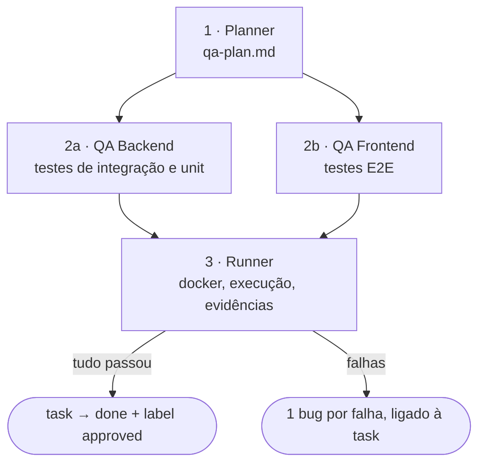

# /factory:qa

Testa **uma task que está em `qa_gate`**: planeja os cenários a partir do blueprint, escreve testes de
backend e E2E lendo o código real, roda tudo com vídeo e evidências e fecha a task, ou abre bugs ligados
a ela.

```text
/factory:qa <task-id> [--model papel=valor]
```

## Pipeline



Backend e frontend rodam **em paralelo**. A ETAPA 0 é a mesma das outras fábricas, com uma trava a mais: a
task **precisa** estar em `qa_gate`, e `qa_gate` precisa ser diferente de `in_qa`. Assim uma task já em
teste nunca é pega de novo.

### 1. Planner: o que testar

**Não lê código-fonte.** Planeja a partir do **comportamento esperado** (o blueprint da task) e da lista
de arquivos alterados na branch, só classificada por camada. Ao começar, move a task para `in_qa` e
comenta que o QA iniciou.

O plano tem cenários com ID, que depois dão nome aos testes:

| Prefixo | Tipo | Exemplos |
|---|---|---|
| `I-XX` | integração HTTP, por endpoint | caminho feliz, campo obrigatório, 404, sem autenticação (401), sem permissão (403), duplicata (409) |
| `U-XX` | unitário | só para lógica pura que vale isolar do banco |
| `E-XX` | E2E, por tela | carrega autenticada, redireciona sem login, criar, validação de formulário, editar, excluir |
| `G-XX` | regressão | áreas vizinhas que a mudança pode ter afetado |

Se o projeto isola dados por usuário ou tenant, o plano inclui o cenário "só vê os próprios". Se a branch
está atrás da base, o plano avisa para considerar rebase. O plano é salvo e **postado na task**.

### 2a. QA Backend: testes contra o código real

**O código implementado é a fonte de verdade.** Antes de escrever, abre controllers, validação, models,
services, rotas e migrations para extrair endpoint, parâmetros, status e códigos de erro **reais**. Se o
código diverge do plano, testa o que foi implementado e documenta a divergência no próprio teste.

- usa o framework do projeto (`stack.backend.test`) e os helpers existentes (`tests.backend_helpers`);
- isola cada teste com o mecanismo da stack (transação, banco efêmero ou cleanup no teardown);
- um cenário do plano = um teste, com o ID no nome (`I-01: …`);
- **nunca** mocka o ORM nem chuta nome de campo; job ou evento disparado é testado com o *fake* da stack;
- achou um bug lendo o código? Marca `// BUG POTENCIAL` e escreve o teste mesmo assim.

### 2b. QA Frontend: E2E com seletores reais

Lê rotas, guards, templates e componentes antes de escrever e monta uma **tabela de seletores reais**
(campos de formulário, botões, `data-testid`, textos). Seletor instável ganha um
`// TODO: data-testid` em vez de um chute.

- login **programático** por papel (`tests.frontend_cmds`, `tests.roles`), não pelo formulário;
- vídeo sempre ligado e screenshot em falha;
- limpeza dos dados criados via API ao final;
- espera por asserção com timeout, nunca `sleep` fixo;
- **nunca** mocka HTTP: o E2E roda contra o backend de verdade.

### 3. Runner: executar e reportar

1. **Prepara:** faz checkout e pull da branch da task e compara com a base; conflito para tudo.
2. **Sobe a stack** se `docker.ensure_up` estiver ligado, com migrate e seed do banco de teste.
3. **Confere os serviços:** `env.api_url` e `env.app_url` precisam responder. Offline, só comenta na task e
   **não roda nada**.
4. **Smoke test:** o script do projeto ou login mais um endpoint. Falhou, para.
5. **Executa** `docker.run` (e `docker.run_frontend`, se existir, em paralelo) com modo de evidência ligado,
   *slow motion* e resolução do config.
6. **Coleta** vídeos, screenshots e resultados em `docs/initiatives/<nome>/evidencias/<data-hora>/`.
7. **Reporta:**
    - **tudo passou:** comenta o relatório, move para **`done`** e aplica a label `approved`;
    - **houve falha:** abre **um bug por teste falho**, ligado à task (não ao épico), e comenta o resumo. A
      task fica em `in_qa`.

O relatório (`qa-report-<task>.md`) traz uma tabela por cenário e métricas de tempo.

## Config que ela exige

Além das chaves gerais: `tests.dir`, `tests.layout.backend`, `tests.layout.frontend`, `stack.backend.test`,
`stack.frontend.e2e`, `env.app_url`, `env.api_url`, `docker.run`, `docker.ensure_up` e o bloco `evidence`.
Veja a [referência de configuração](../reference/config.md).

## Modelos padrão

| Papel | Modelo |
|---|---|
| `qa.planner` | `fable` |
| `qa.backend` · `qa.frontend` | `opus` |
| `qa.runner` | `sonnet` |
