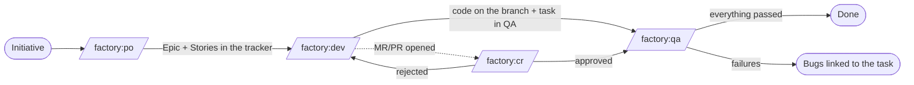

# Factory

**Agent factories for Claude Code** that take an idea from the roadmap to reviewed, tested code,
going through the team's task tracker. Each factory is an assembly line with fixed steps, specialized
agents in isolated contexts and **stopping points where a human decides**.

## What it solves

Asking an agent to "implement this feature" works for small tasks. In real work the same problems show
up: the agent skips the research, invents names that don't exist in the code, forgets the tracker,
tests too little and leaves no trace of what it decided.

The factory replaces the loose request with a **process**:

- **Steps with defined input and output.** Each step produces a Markdown artifact (research, code map,
  blueprint, technical plan, reports) and only moves forward if that artifact passes a *gate*.
- **One role per agent.** Researcher, blueprint architect, tech lead, developer, reviewer, QA: each one
  runs in its own context, with the tools the role needs and nothing more.
- **The tracker is part of the flow.** Stories are born in the tracker, the task changes status as the
  work progresses, comments record what was done, QA bugs become issues linked to the task.
- **Nothing is project-specific.** Stack, paths, branches, tracker and statuses come from a
  configuration file per repository. The same factory serves projects in Laravel, NestJS, Angular or
  Next.js, with Jira, ClickUp, GitLab, GitHub or a Markdown kanban.

## The factories

| Command | Input | What it delivers |
|---|---|---|
| [`/factory:init`](factories/init.md) | project path | `docs/factory.config.md` with detected stack, tracker and git |
| [`/factory:po`](factories/po.md) | initiative name | market research, code map, blueprint and **Epic + Stories** in the tracker |
| [`/factory:dev`](factories/dev.md) | task id | technical plan, code on the branch, review, validated build and task in QA |
| [`/factory:qa`](factories/qa.md) | task id | test plan, backend and E2E tests, execution with video and **done** or **bugs** |
| [`/factory:cr`](factories/cr.md) | task id | review and security audit of the MRs/PRs, **human verdict**, comments and status |

## Where the human comes in

The factory automates the repetitive work, not the decisions:

- **Configuration:** `/factory:init` suggests, but only writes what you confirm.
- **Doubts along the way:** any agent that is not sure returns `BLOCKED` with the question, and the
  orchestrator asks you instead of guessing.
- **Code review:** the CR factory recommends, but you are the one who approves or rejects, with the reason.
- **Priority:** the PO factory creates the stories in the backlog; sprint order is the team's decision.

## Next steps

- [Getting started](getting-started.md): install, generate the config and run the first initiative.
- [Concepts](concepts.md): config, contract, drivers, logical statuses and gates.
- [Configuration reference](reference/config.md): every key in `factory.config.md`.
