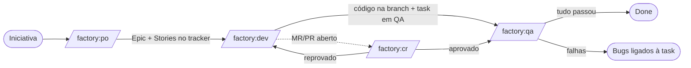

# Factory

**Fábricas de agentes para Claude Code** que levam uma ideia do roadmap até código revisado e testado,
passando pelo tracker de tarefas do time. Cada fábrica é uma linha de montagem com etapas fixas, agentes
especializados em contexto isolado e **pontos de parada onde um humano decide**.

## O que ela resolve

Pedir "implementa essa feature" para um agente funciona em tarefas pequenas. Em trabalho de verdade aparecem
os mesmos problemas: o agente pula a pesquisa, inventa nomes que não existem no código, esquece o tracker,
testa pouco e não deixa rastro do que decidiu.

A fábrica troca o pedido solto por um **processo**:

- **Etapas com entrada e saída definidas.** Cada etapa gera um artefato em Markdown (pesquisa, mapa do
  código, blueprint, plano técnico, relatórios) e só avança se esse artefato passar num *gate*.
- **Um papel por agente.** Pesquisador, arquiteto de blueprint, tech lead, developer, revisor, QA: cada
  um roda no seu próprio contexto, com as ferramentas que o papel precisa e nada mais.
- **O tracker é parte do fluxo.** Stories nascem no tracker, a task muda de status conforme o trabalho
  anda, comentários registram o que foi feito, bugs de QA viram issues ligadas à task.
- **Nada é específico de projeto.** Stack, caminhos, branches, tracker e status vêm de um arquivo de
  configuração por repositório. A mesma fábrica serve projetos em Laravel, NestJS, Angular ou Next.js,
  com Jira, ClickUp, GitLab, GitHub ou um kanban em Markdown.

## As fábricas

| Command | Entrada | O que entrega |
|---|---|---|
| [`/factory:init`](factories/init.md) | caminho do projeto | `docs/factory.config.md` com stack, tracker e git detectados |
| [`/factory:po`](factories/po.md) | nome da iniciativa | pesquisa de mercado, mapa do código, blueprint e **Epic + Stories** no tracker |
| [`/factory:dev`](factories/dev.md) | id da task | plano técnico, código na branch, review, build validado e task em QA |
| [`/factory:qa`](factories/qa.md) | id da task | plano de testes, testes backend e E2E, execução com vídeo e **done** ou **bugs** |
| [`/factory:cr`](factories/cr.md) | id da task | review e auditoria de segurança dos MRs/PRs, **veredito humano**, comentários e status |

## Onde o humano entra

A fábrica automatiza o trabalho repetitivo, não as decisões:

- **Configuração:** o `/factory:init` sugere, mas só grava o que você confirma.
- **Dúvida no meio do caminho:** qualquer agente que não tem certeza devolve `BLOCKED` com a pergunta, e o
  orquestrador pergunta a você em vez de chutar.
- **Code review:** a fábrica CR recomenda, mas quem aprova ou reprova é você, com o motivo.
- **Prioridade:** a fábrica PO cria as stories no backlog; ordem de sprint é decisão do time.

## Próximos passos

- [Começando](getting-started.md): instalar, gerar o config e rodar a primeira iniciativa.
- [Conceitos](concepts.md): config, contrato, drivers, status lógicos e gates.
- [Referência de configuração](reference/config.md): todas as chaves do `factory.config.md`.
